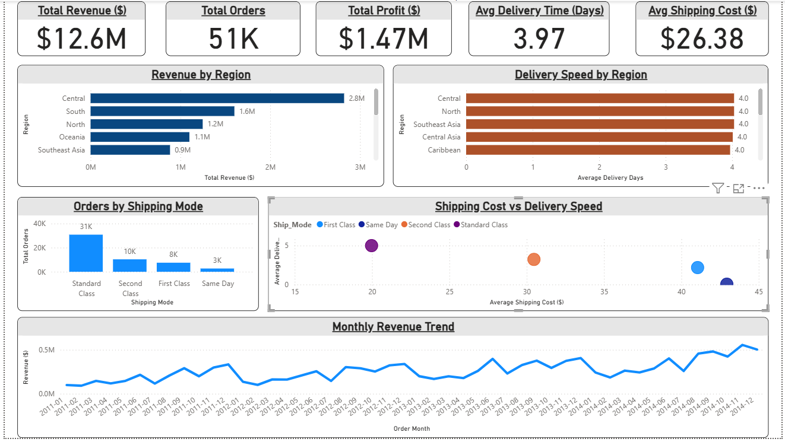
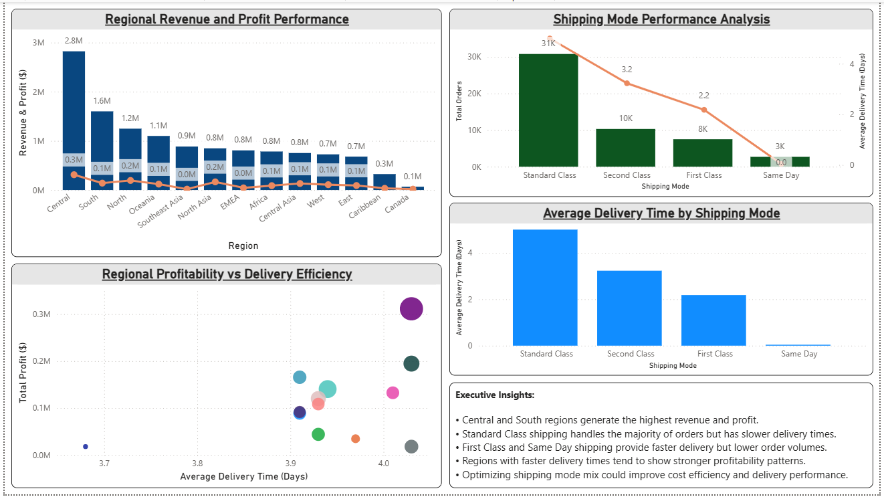

# 📦 E-Commerce Logistics Analytics (Capstone Project)

## 📊 Project Overview

This Capstone Project analyzes **global e-commerce logistics performance** using **Excel, MySQL, and Power BI**.

The project focuses on:

- Delivery performance
- Shipping efficiency
- Regional profitability
- Logistics cost optimization
- Revenue trends

This project demonstrates a **complete end-to-end data analytics workflow**:

**Excel → SQL → Power BI**

---

## 🎯 Business Problem

E-commerce companies must balance:

- Fast delivery
- Low shipping cost
- High profitability

This project answers key business questions:

- Which regions generate the highest revenue?
- Which shipping modes deliver fastest?
- How shipping cost affects delivery speed?
- Which regions are most profitable?
- How business performance changes over time?

---

## 📊 Dataset

Dataset Used:

**Global Superstore Dataset**

Dataset contains:

- 51,000+ Orders
- Multiple Regions
- Shipping Modes
- Sales Data
- Profit Data
- Shipping Costs
- Order Dates

---

## 🛠 Tools Used

### Excel

Used for:

- Data exploration
- Delivery days calculation
- Pivot tables
- Data validation

### MySQL

Used for:

- Table creation
- Data cleaning
- Feature engineering
- KPI queries
- Analytical views

### Power BI

Used for:

- Dashboard development
- KPI cards
- Trend analysis
- Logistics analytics

---

## 🏗 Project Workflow

### Step 1 — Excel Analysis

- Data exploration
- Delivery Days calculation
- Pivot tables
- KPI validation

### Step 2 — SQL Development

Created:

- Raw_Logistics Table
- Data Cleaning Queries
- KPI Queries
- Analytical Views

Views Created:

- KPIs
- RegionPerformance
- ShippingAnalysis
- MonthlyTrend
- DeliveryPerformance

### Step 3 — Power BI Dashboard

Created two dashboard pages:

- Global Overview
- Deep Dive Analysis

---

## 📊 Dashboard Preview

### Global Logistics Performance Overview

---

### Logistics Deep Dive Analysis

---

## 📈 Dashboard Features

### Page 1 — Global Logistics Performance Overview

KPIs:

- Total Revenue
- Total Orders
- Total Profit
- Average Delivery Time
- Average Shipping Cost

Charts:

- Revenue by Region
- Delivery Speed by Region
- Orders by Shipping Mode
- Shipping Cost vs Delivery Speed
- Monthly Revenue Trend

---

### Page 2 — Logistics Deep Dive Analysis

Charts:

- Regional Revenue and Profit Performance
- Shipping Mode Performance Analysis
- Regional Profitability vs Delivery Efficiency
- Average Delivery Time by Shipping Mode

---

## 📌 Key Insights

### Revenue

- Central region generates highest revenue
- South region is second strongest

### Shipping Performance

- Standard Class handles majority of orders
- Same Day shipping is fastest

### Delivery Performance

- Average delivery time ≈ 4 days

### Optimization Opportunities

- Improve Standard Class delivery speed
- Optimize shipping cost
- Improve low-performing regions

---

## 📂 Project Structure

Ecommerce-Logistics-Project
│
├── Data
├── Excel
├── SQL
├── PowerBI
├── Screenshots
└── README.md

---

## ⭐ Project Type

**Capstone Data Analytics Project**

Includes:

- Excel Analysis
- SQL Modeling
- Power BI Dashboard
- Business Insights

---

## 👨‍💻 Author

**Aatreya Pal**

Aspiring Data Analyst

Skills:

- SQL
- Power BI
- Excel

